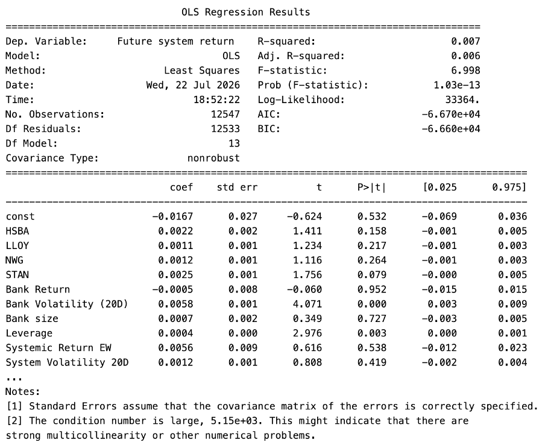
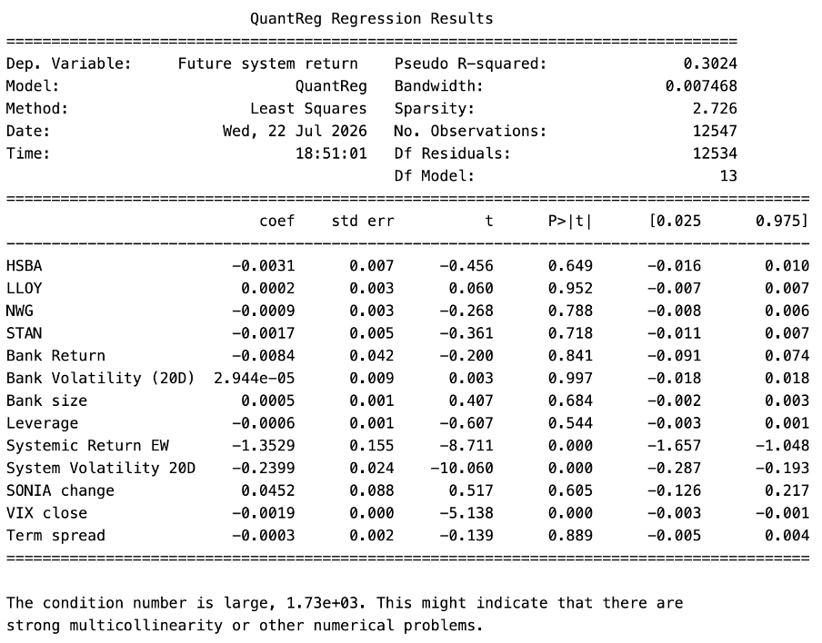
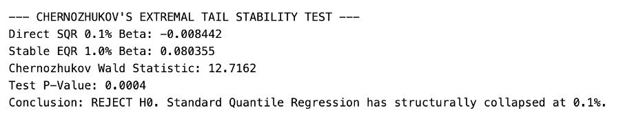
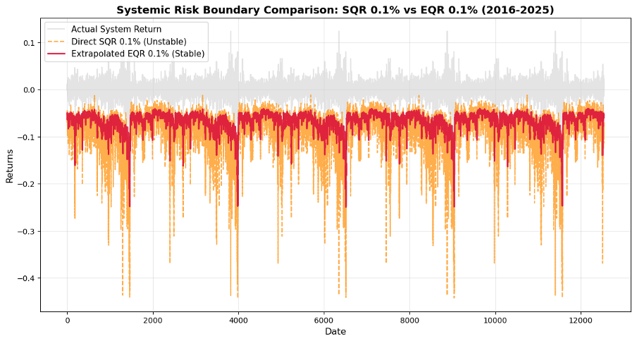

# Forecasting Systemic Risk Using Extremal Quantile Regression

### Evidence in the UK Banking System

This project investigates the forecasting of extreme systemic downside risk in the UK banking system using **Quantile Regression (QR)** and **Extreme Value Theory (EVT)**.

The study focuses on an important challenge in financial risk modelling: estimating extremely low conditional quantiles when observations in the tail are sparse. I develop an **EVT-based Extremal Quantile Regression (EQR)** framework that combines an intermediate Quantile Regression estimate with Peaks-Over-Threshold (POT) modelling to extrapolate into the extreme lower tail.

The analysis was conducted in Python as part of my MSc Risk Analytics dissertation at Queen Mary University of London.

---

## Research Question

Can an EVT-based Extremal Quantile Regression framework provide a useful approach for forecasting extreme systemic downside risk in the UK banking system, particularly at the **0.1% conditional lower tail**?

---

## Data

The analysis uses daily financial and macro-financial data covering **2016–2025**.

The sample includes five major UK-listed banks:

- HSBC
- Barclays
- Lloyds Banking Group
- NatWest Group
- Standard Chartered

The dataset combines:

- Bank-level returns and volatility
- Bank size and leverage
- System-level banking returns and volatility
- FTSE All-Share returns
- VIX
- UK 10-year government bond yield
- Term spread
- SONIA changes

Data were sourced from Bloomberg, BankFocus and the Bank of England.

The dependent variable is **Future 1-Day System Return Ex-Bank**, constructed to examine whether information about an individual bank and broader market conditions is associated with subsequent movements in the remaining banking system.

---

## Methodology

The project compares three modelling approaches:

### 1. Ordinary Least Squares (OLS)

Used as a benchmark to model the conditional mean of future systemic returns.

### 2. Quantile Regression (QR)

Used to investigate how the relationships between financial variables and systemic returns change across the conditional distribution, with particular attention to adverse market conditions.

### 3. EVT-based Extremal Quantile Regression (EQR)

The proposed framework combines:

**5% Quantile Regression**
→ **Lower-tail residuals**
→ **Peaks-Over-Threshold (POT)**
→ **Generalised Pareto Distribution (GPD)**
→ **0.1% extreme quantile extrapolation**

A rolling window of 1,000 observations is used for the out-of-sample forecasting exercise.

---

## Key Results

### OLS


The benchmark OLS model produced an R² of **0.007**, indicating limited explanatory power for the conditional mean of future systemic returns.

### Quantile Regression


The QR analysis identified stronger relationships in the lower part of the conditional distribution than were visible from the conditional mean.

Systemic return, system volatility and VIX showed statistically significant relationships with the selected lower conditional quantile.

### Extreme Quantile Estimation
### Extreme Quantile Estimation

Direct estimation of the **0.1% quantile using Standard Quantile Regression (SQR)** showed substantial instability.

The Chernozhukov extremal tail stability test produced:

- SQR estimate: **−0.0084**
- EQR estimate: **0.0804**
- Test statistic: **12.716**
- p-value: **0.0004**

The stability hypothesis was rejected, providing evidence that the direct extreme-quantile relationship becomes unstable as the target moves deeper into the tail.



### EVT-Based Extremal Quantile Regression

To address the instability of direct extreme-quantile estimation, the EQR framework combines an intermediate quantile regression with Extreme Value Theory.

The estimated GPD tail index was:

**ξ = 0.4634**

indicating heavy-tailed behaviour in the fitted lower tail.



The EVT-based EQR estimates were substantially smoother than the direct 0.1% SQR estimates while retaining time variation in the estimated systemic-risk boundary.

### Backtesting


Out-of-sample backtesting produced:

- **15 realised violations**
- **12.55 expected violations**
- **p-value = 0.4886**

The null hypothesis of the backtesting procedure was not rejected, meaning the observed violation frequency was statistically consistent with the nominal tail probability under the test.

---

## Technologies

- **Python**
- Pandas
- NumPy
- Statsmodels
- Matplotlib
- Scikit-learn
- Jupyter Notebook
- Statistical modelling
- Quantile Regression
- Extreme Value Theory
- Generalised Pareto Distribution
- Peaks-Over-Threshold
- Backtesting

---

## Project Structure

```text
Systemic-Risk-using-EQR/
│
├── README.md
├── Systemic_Risk_Analysis_Results.ipynb
├── Data.xlsx
└── figures/
    ├── Correlation_matrix.png
    ├── Descriptive_data.png
    ├── OLS_model_result.png
    ├── Quantile_Regression_analysis_result.png
    ├── EQR_model_analysis.png
    ├── Forecasting_systemic_risk.png
    ├── Extremal_Quantile_Backtesting_result.png
    └── Chernozhukov_test_for_EQR_model_result.png
